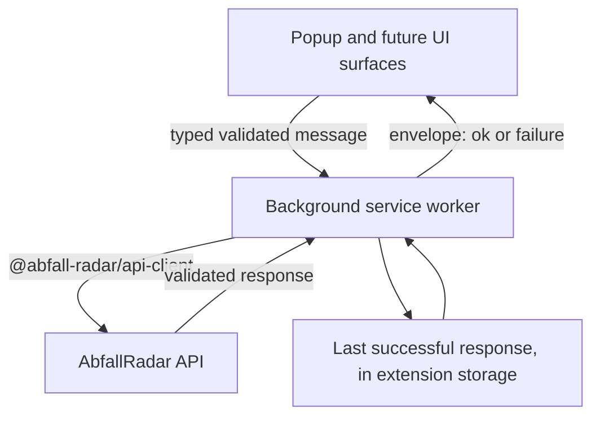

# Browser extension

The browser extension is the first AbfallRadar product surface. It owns browser lifecycle,
permissions, storage, alarms, notifications, and popup composition.

Domain rules and reusable visual primitives are imported from workspace packages rather than
reimplemented here. See [ADR 0004](../../docs/decisions/0004-extension-api-integration.md) for the
decisions this application implements.

## The extension is a pure API client

Its **only** data boundary is the AbfallRadar HTTP API. It never retrieves, parses, or interprets a
municipal calendar, and it requests no municipal host permission because it contacts no municipal
host — ingestion happens server-side.

`@abfall-radar/data-providers` is no longer in its dependency graph at all. Demo schedules have stopped
being a product surface concern, and `src/boundaries.test.ts` asserts that no module imports the package
and that the manifest does not declare it.

## The worker owns the network boundary

Manifest V3 has one place where a network boundary belongs. The background service worker owns
lifecycle, storage, and alarms; a popup is a short-lived window that can be closed mid-request, so a
request in flight when it closes would have nowhere to deliver a validated response — and the cache
would never be written by exactly the requests most likely to matter.



- Only the worker constructs a request. `src/boundaries.test.ts` walks the popup entry's import graph
  and fails if `@abfall-radar/api-client` is reachable from it.
- The contract is validated at runtime **on both sides**. A message crosses a process boundary, so it
  is untrusted input even though both sides ship in one artifact.
- The handler answers with `sendResponse` and returns `true` — the selected compatibility baseline for
  the Chrome versions this project supports, not a claim about what Chrome will support later.
- **No rejection escapes.** Every path answers with an envelope, because a dropped reply leaves the
  popup waiting for something that never arrives.

### The message contract

| Request | Performs |
| --- | --- |
| `list_providers` | `GET /api/v1/providers` |
| `list_service_areas` | `GET /api/v1/providers/{providerId}/service-areas` |
| `list_collection_events` | `GET .../collection-events?from&to` |
| `restore_cached_schedule` | **No request.** Reads the local cache only. |
| `invalidate_cached_schedule` | **No request.** Drops one local cache entry. |

`restore_cached_schedule` deliberately accepts no `from` or `to`: the worker derives the window from the
cached entry's own capability snapshot, so a caller cannot ask for a range the cache was never evaluated
against. It is what lets an offline start paint before anything is fetched — the case the cache exists
for.

`invalidate_cached_schedule` exists because the cache belongs to the worker and the popup must still be
able to act on an authoritative `unavailable`. It takes no range either — there is nothing to evaluate,
only an entry to drop — and answers `{ ok: true, data: null }` whether or not an entry existed. **No popup
module may import the schedule-cache storage module**; a test asserts that across the whole popup-owned
tree.

See the approved implementation clarifications in
[AR-004](../../docs/tasks/AR-004-extension-api-integration.md).

Message-envelope and persisted-storage schemas are **strict**: both sides are built together, so an
unexpected member is a defect rather than a newer contract. API response validators, by contrast, strip
unknown members so an additive server field cannot break an installed extension.

### Failures

| Kind | Members — exactly these | Request identifier |
| --- | --- | --- |
| `problem` | `kind`, `operation`, `status`, `code`, `requestId` | Present, from the validated body |
| `network` | `kind`, `operation` | None |
| `timeout` | `kind`, `operation`, `timeoutMs` | None |
| `cancelled` | `kind`, `operation` | None |
| `invalid_response` | `kind`, `operation`, `status` | None |
| `unsupported_message` | `kind` **only** | None |

A support identifier is displayed **only** when a validated Problem Details response supplied one.
Fabricating one — a generated value, an empty string, a dash — would hand someone something to quote
that matches nothing in any server log, which is worse than plainly stating the API was never reached.

`unsupported_message` carries its `kind` and nothing else: it is raised when an inbound message fails
envelope validation, so there is no trustworthy operation to name, and the refused kind is untrusted
input that must not be echoed back or logged.

`timeoutMs` is the **configured deadline** (`8000` by default), never a measured elapsed duration.

Logs carry only the failure kind, the operation where one exists, `timeoutMs` on a timeout, and the
status, `code`, and `requestId` on a `problem`. Never `detail`, `instance`, `errors`, a server message,
an upstream URL, a payload, a stack trace, or a refused message kind — a browser console is not a
private place to put any of them.

## Configuration

The API base URL is **build-time configuration only**. There is no user-editable API URL, no settings
field, and no runtime override: a user-supplied URL would make the extension a request-forgery surface
and make every response impossible to attribute to a known contract.

| Variable | Meaning | Default |
| --- | --- | --- |
| `WXT_API_BASE_URL` | The API origin. Scheme, host, and optional port only. | `http://127.0.0.1:3000` |
| `WXT_RELEASE` | Marks the controlled release and packaging path. | unset |

- The value is validated and normalized by `parseApiBaseUrl` from `@abfall-radar/api-client`, which the
  build configuration and the application code both call, so the requested host permission and the
  origin every request is built from cannot disagree.
- A value carrying credentials, a path, a query, a fragment, an unusable scheme, or nonsense **fails the
  build** rather than being silently trimmed.
- Unset resolves to the loopback literal `127.0.0.1`, which is exactly where `apps/api` listens by
  default. The literal is used rather than `localhost` so no name resolution can send a request to an
  address the API is not bound to.
- **No production domain is invented or committed.** There is nothing to name yet, and a placeholder
  host in a manifest is indistinguishable from a real one to everything that reads it.

## Permissions

The built manifest requests exactly:

```json
{
  "permissions": ["alarms", "notifications", "storage"],
  "host_permissions": ["http://127.0.0.1/*"]
}
```

No `<all_urls>`, no `optional_host_permissions`, no `tabs`, no `activeTab`, and no municipal host.

**A Chrome match pattern cannot express a port.** The pattern derived from `http://127.0.0.1:3000`
grants the host, not the port, so the granted permission is broader than the requests the extension
makes. The port is enforced where it can be: every request is built from the exact configured base URL,
so no other port is ever contacted. Recording that openly matters more than implying a narrower grant
than Chrome can represent.

## States

The schedule surface derives every state from one pure function, and every claim it makes is bounded by
that state's `displayRange`.

| State | Meaning |
| --- | --- |
| `needs_selection` | No area chosen. Nothing is preselected, fetched, or reminded about. |
| `loading` | Nothing has arrived yet. |
| fresh | A current response. The only state that may be labelled fresh. |
| stale | A current response the source could not refresh. Keeps its earlier retrieval time. |
| cached, offline | A restored entry while the API is unreachable. |
| cached, refresh failed | A restored entry after the API answered with a failure. |
| cached, partial | A restored entry that covers only part of the requested window. |
| empty | No collection inside a covered range. |
| range not covered | The source publishes no calendar for the current period, or a `422`. |
| error | Nothing trustworthy is available. |

A restored entry is always labelled with its own retrieval time, stays labelled cached or offline, and
is relabelled only when a current response replaces it. **Old data is never presented as fresh.**

An empty result inside a covered range reads as "no collection in this period"; a selected waste type
outside `coverage.wasteTypes` is labelled as not published by that source. Those are different
statements and the surface never conflates them.

### The requested range

The current date is derived **in the zone the source publishes in**, using `Intl.DateTimeFormat` with
`formatToParts` and the calendar pinned to `gregory` and the numbering system to `latn`. A formatted
string is never parsed and the device zone is never used: "today" for a collection schedule is today in
the municipality's zone, and deriving it from the browser would shift the whole window for anyone whose
device is set elsewhere.

The window is 90 calendar days forward, clamped into the declared validity window. When the derived
today is past the window's end, or the clamp inverts, **no request is issued** and the surface says the
source publishes no calendar for the current period.

### The cache

- Keyed by the **normalized API origin**, the provider, and the area, so development data can never be
  presented under a different configured origin.
- Only a response that passed transport validation is cached. A failed refresh writes nothing and
  preserves every still-usable entry.
- An entry is overwritten only when its `retrievedAt` is not older than the stored one.
- Retained for 7 days, mirroring the server's stale-if-error window. An expired or foreign-origin entry
  is evicted rather than retained.
- **A cached entry is restored only through the intersection of its served range with the range now
  being requested.** The requested window moves forward every day, so a cache served for yesterday's
  window does not answer today's question. A partial intersection is never presented as coverage of the
  complete window: rendering an uncovered tail as "no collection scheduled" would be a confident claim
  about a period with no data behind it.
- Restoring bounds only the presented view; the stored entry keeps its full contents and its own served
  range.

Startup runs two independent paths. The cached restore paints first and touches no network; the live
provider and service-area refresh runs alongside it. A later successful capability response is
authoritative: a matching snapshot leaves the displayed range alone, a changed zone or window
re-evaluates the displayed cache **before** any events request, and an area that is now `unavailable`
invalidates the stored selection and stops its cached schedule being presented.

Because the two paths are independent, an area reported `unavailable` needs both halves of that: the
attempt's in-flight cache restore is **superseded before the state is cleared**, so a reply arriving a
moment later cannot repaint the withdrawn schedule, and the worker is asked to **drop the cache entry** so
a later restore for that key finds nothing. Superseding by attempt identifier alone would not work — the
restore belongs to the same attempt.

## Reminders

The alarm keeps its name, its schedule, and its behavior. Only its data source changed: it reads
settings through the repository and the schedule through the worker gateway.

A notification is unprompted and tells someone to act, so the rules are stricter than for the popup: it
considers **only** events inside the cache's covered intersection, an absence outside that range is never
read as nothing being scheduled, and with no selection or nothing trustworthy available it shows nothing.

## Settings

Persisted settings are versioned and strict, and the selection is **one value** —
`{ providerId, serviceAreaId }` or `null` — so a half-chosen selection is unrepresentable.

`src/storage/settings-repository.ts` is the **only** reader and writer of the raw storage item. Both the
popup and the background path go through it, because a second raw reader is how a half-migrated value
reaches a product surface. It also refuses to persist a selection for an area whose capability says no
calendar is published, so that guarantee does not rest on the UI.

The only automatic migration is the verified mapping recorded in
[AR-003](../../docs/tasks/AR-003-official-ics-provider.md):

| Legacy `districtId` | Migrated selection |
| --- | --- |
| `koblenz-stadtmitte` | `{ providerId: 'koblenz-servicebetrieb', serviceAreaId: 'koblenz-stadtmitte' }` |
| anything else | `null` |

No other legacy identifier has a verified official counterpart, so none is invented: mapping by name
similarity would silently move someone to an area nobody checked, and a wrong collection area produces
confidently wrong dates. Unrelated settings are preserved, and the new version is written **only** after
a successful migration.

## Unavailable service areas

Two exclusions operate at different levels and must not be confused.

**A provider whose `sourceKind` is `demo` is filtered out entirely, at the catalogue.** It is never
offered, so none of its areas is ever listed, reachable, or rendered. That is stronger than
unselectability and happens earlier.

**Within an offered provider**, an area whose capability is `unavailable` is a different case: the
provider is legitimate and the area exists, but this source publishes no calendar for it. Such an area

- stays **visible with explanatory copy**, because hiding it would imply the municipality does not serve
  the area — a different and unfounded claim;
- **cannot be selected or confirmed** by pointer or keyboard, and cannot be persisted;
- **causes no collection-events request and no reminder**;
- **reports its disabled state to assistive technology**. Appearance is not the mechanism: a row that
  merely looks greyed while still activating on Enter is the failure mode being ruled out.

These rules are verified by deterministic interaction tests against a fixture of an offered non-demo
provider whose area list mixes an `available` and an `unavailable` area. The live API currently offers no
unavailable area under a non-demo provider, and exposing the demo provider to manufacture one would break
the very rule being verified.

## Development

```bash
pnpm dev:extension
```

For a production build, and to load the result from `chrome://extensions` with Developer mode enabled:

```bash
pnpm --filter @abfall-radar/extension build
# then load apps/extension/.output/chrome-mv3
```

Run `pnpm dev:api` alongside it, because the extension has no data source other than the API.

## Verification

```bash
pnpm --filter @abfall-radar/extension test
pnpm --filter @abfall-radar/extension typecheck
pnpm --filter @abfall-radar/extension build
```

None of these sets `WXT_RELEASE`, and neither does `pnpm check`.

## Release and packaging

`zip` and `zip:firefox` are the controlled packaging entry points and set `WXT_RELEASE=1` themselves, so
packaging can never silently produce an artifact pointed at a development origin because the variable was
forgotten. `WXT_API_BASE_URL` stays externally supplied and is never hardcoded.

```bash
WXT_API_BASE_URL=https://api.example.invalid pnpm --filter @abfall-radar/extension zip
WXT_API_BASE_URL=https://api.example.invalid pnpm --filter @abfall-radar/extension zip:firefox
```

A release or packaging build **fails** unless `WXT_API_BASE_URL` is explicitly supplied and is a
non-loopback HTTPS origin:

```bash
pnpm --filter @abfall-radar/extension zip
# ERROR  A release build cannot be produced: WXT_API_BASE_URL must be supplied explicitly.

WXT_API_BASE_URL=http://127.0.0.1:3000 pnpm --filter @abfall-radar/extension zip
# ERROR  A release build cannot be produced: WXT_API_BASE_URL must not be a loopback origin in a release build.

WXT_API_BASE_URL=http://api.example.invalid pnpm --filter @abfall-radar/extension zip
# ERROR  A release build cannot be produced: WXT_API_BASE_URL must use https in a release build.
```

`scripts/release.ts` is what sets the variable. It runs on Node 24 directly and calls `wxt`'s
programmatic `zip()`, so the packaging path needs neither `tsx` nor `cross-env` and stays portable across
shells.

**It must import nothing from `src/`.** Node executes it rather than bundling it, and this workspace's
relative imports are extensionless because a bundler resolves them — so a single import from the
application graph pulls in `@abfall-radar/api-client` and fails module resolution *before* the release gate
can run, turning a configuration error into a confusing crash. The variable name is therefore written
literally in the script, and `src/config/api-origin.test.ts` asserts that literal still matches
`RELEASE_FLAG_ENV_KEY`.

**The API is not deployed, so this milestone deliberately cannot produce a shippable artifact.** The
release gate is what keeps that fact from being shipped by accident.

## Architecture

```text
entrypoints/
  background.ts        The service worker: the only place that constructs an HTTP request
  popup/               Popup shell and composition
src/
  adapters/            Transport-to-domain mapping, validated through the domain schema
  background/          The gateway, its logging seam, and the reminder path
  config/              Build-time API origin, the derived manifest, and the release gate
  features/            Dashboard, settings, and the needs-selection surface
  hooks/               Settings, catalogue, and schedule orchestration
  messaging/           The typed message contract and the UI-side client
  schedule/            Capability, range derivation, intersection, and view-state derivation
  storage/             Versioned settings, the sole repository, the schedule cache, reminder state
  test/                Setup and fixtures
scripts/
  release.ts           The controlled packaging entry point
```

Transport and domain names differ on purpose: `serviceAreaId` is the location-neutral transport term for
the domain's `districtId`, and `wasteType` is its `type`. `src/adapters/collection-event.ts` is the one
place that renames them, and it **validates** the result through `CollectionEventSchema` rather than
asserting it. That keeps `getUpcomingEvents`, `findReminderEvent`, and `getRelativeDateLabel` working
unchanged.

## Responsive and accessible

- Verified at 320 px, at the popup width, and at a tablet width, with no horizontal page scrolling.
- Provenance and freshness are conveyed by text **and** an icon, never by colour alone.
- State transitions are announced through a polite live region, so a change from cached to fresh is not
  silent for a screen-reader user.
- Every control has an accessible name and visible focus; primary touch targets stay at least 44 by
  44 CSS pixels.
- Only the semantic tokens from `@abfall-radar/ui` are used.
- Code, comments, tests, documentation, and identifiers are English. User-visible copy is German,
  matching the existing product copy until a localization layer exists.
