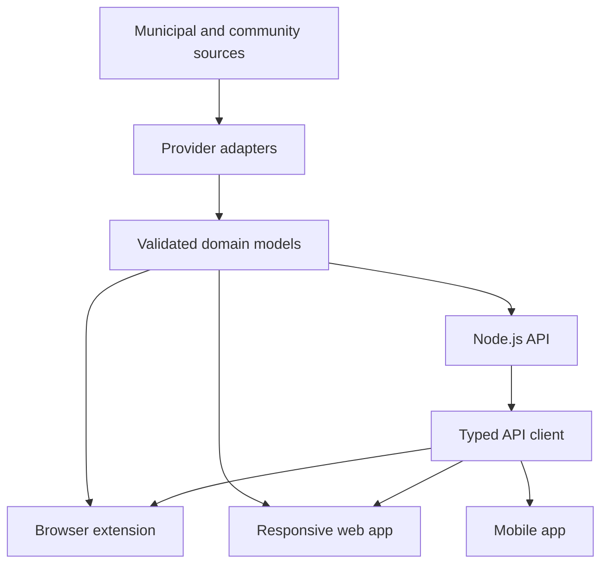
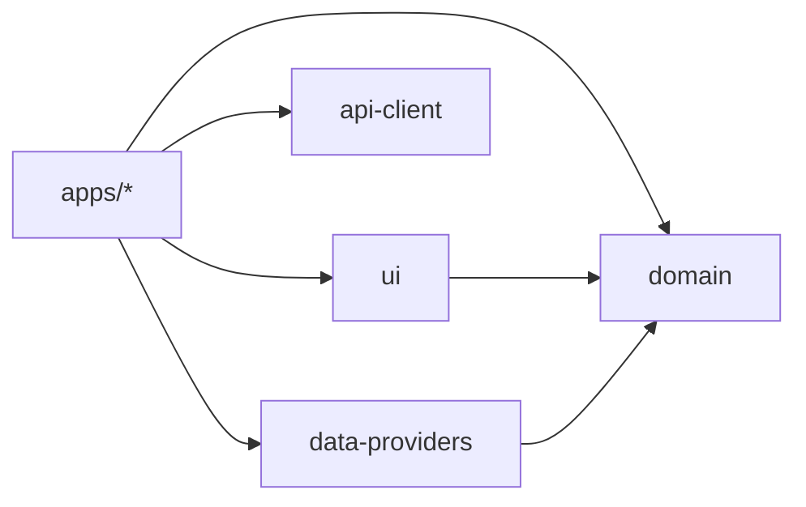

# Repository architecture

## Goals

- Keep deployable products independently buildable.
- Share stable domain, provider, API, and visual contracts without copying.
- Allow a municipal source to be added without changing product behavior.
- Preserve a clear path from local-only extension behavior to a normalized backend.

## System context



The extension now reads the API exclusively through `api-client`; it no longer resolves a provider
locally. The normalized domain model remains the boundary that product surfaces consume, and the
transport-to-domain mapping is one explicit adapter inside the consumer.

## The api-client boundary

`packages/api-client` is browser-safe and transport-only, per
[ADR 0004](../decisions/0004-extension-api-integration.md). Two rules shape it beyond the ownership table
above.

**It does not depend on `packages/domain`.** This package owns the wire shape and the domain owns the
business model; neither is expressed in terms of the other. Mapping between them belongs to whichever
consumer needs it, and stays there unless [the extraction rule](#when-a-mapping-becomes-shared) is
satisfied.

**A transport operation is not a product phase.** `packages/api-client` reports the real endpoint
operation that failed; the application request owner records why that call was running and owns the
resulting Retry transition. Product code must not rewrite the transport operation or infer Retry from
it, a retained selection, or an identifier alone. This keeps failure translation in `api-client` and
application state, attempt ownership, and retry policy in the consuming app.

**Its types are generated and its validators are hand-written.** OpenAPI stays the canonical contract, so
`src/generated/` is emitted from the document and never edited. Runtime validators are hand-written and
scoped to the untrusted HTTP boundary, because generated types vanish at runtime. A compile-time check
pins each validator to its generated type, and a drift test in `apps/api` fails when either committed
artifact is stale.

Generation is owned by `apps/api`, which owns the contract: its script builds the application in process
and writes both artifacts, including the one inside `packages/api-client`. That dev-time coupling points
from an application to a package, which the dependency direction allows. The inverse — tooling inside a
shared package reaching into an application's layout — is the direction the architecture forbids.

## The extension network boundary

`apps/extension` constructs an HTTP request in exactly one place: the Manifest V3 background service
worker. A popup is a short-lived window, so letting each UI surface issue its own requests would scatter
the timeout, cache, and error policy across components that are destroyed when it closes.

Every other surface reaches data through a typed message contract that is validated at runtime on both
sides, because a message crosses a process boundary even though both sides ship in one artifact. The
boundary is enforced mechanically: a test walks the popup entry's import graph and fails if `api-client`
is reachable from it.

Message-envelope and persisted-storage schemas are **strict**, while API response validators **strip**
unknown members. The difference is deliberate: an unexpected member on an internal boundary is a defect,
whereas an additive server field must not break an installed extension.

## Workspace ownership

| Workspace | Owns | Must not own |
| --- | --- | --- |
| `apps/extension` | Browser lifecycle, permissions, storage, alarms, popup composition, the worker-owned network boundary | Municipal parsing, reusable domain rules, or HTTP outside the background worker |
| `apps/web` | Web shell and feature composition, application state, the request lifecycle, and one named web data boundary that owns every HTTP call | Browser extension APIs, municipal parsing, HTTP outside its data boundary |
| `apps/api` | HTTP composition, persistence, jobs, provider orchestration | Product UI |
| `apps/mobile` | Native shell and native feature composition | DOM components |
| `packages/domain` | Schemas, models, pure business rules | Frameworks, I/O, municipality details |
| `packages/data-providers` | Source contracts, adapters, normalization | Product UI or persisted user settings |
| `packages/schedule-format` | Framework-free schedule presentation rules: source-local day, event order, featured event, collection day, drop-off window, date formatting, shared copy ([ADR 0006](../decisions/0006-schedule-format-package.md)) | React, the DOM, storage, I/O, application-specific copy |
| `packages/ui` | Semantic tokens, DOM React primitives, and the shared schedule components and menus | Product-specific data fetching, controllers, navigation, storage |
| `packages/api-client` | Typed transport contract, request construction, deadlines, failure translation | Application state, visual behavior, a cache, a product retry policy, or a domain dependency |
| `packages/test-utils` | Cross-workspace builders and adapters | Product-only fixtures |

## Dependency direction



Dependencies only point toward stable shared capabilities. Shared packages never import from
`apps/*`, and domain never imports another product package.

**`api-client` has no edge to `domain`, deliberately.** An application depends on both independently
and owns the mapping between them, per [ADR 0004](../decisions/0004-extension-api-integration.md) and
[the api-client boundary](#the-api-client-boundary) above. A diagram edge from the client to the
domain would contradict both.

## When a mapping becomes shared

This section **explains and applies** the mandatory rule in
[`docs/ai/shared-rules.md`](../ai/shared-rules.md); it does not replace it. The shared rules govern the
repository, and nothing here — including anything labelled canonical — overrides them. The mandatory
wording is:

> Create a new shared abstraction after a real second consumer exists or when a stable domain
> boundary already requires it.

What this section supersedes is narrower: the earlier "**until** a second consumer exists"
formulations that read the first route as the only one.

**The arrival of another consumer — second, third, or any later — triggers only an explicit
comparison and review. Consumer count never mandates extraction.** Counting is a prompt to look, not
a verdict, and no number is a threshold. Extracting on the count alone produces packages that exist
because arithmetic said so, and they accumulate whatever the next consumer also half-needs.

**A new shared package must not be created merely because mobile, or any other consumer, now
exists.**

### The two permitted grounds

Extraction is allowed on **either** ground. They are alternatives, not a conjunction, and the second
one does **not** require a second consumer or any concrete duplication.

**Ground A — demonstrated duplicated behavior that justifies a shared abstraction.** Requires all of:

- **proven identical semantics** — not merely a similar shape. Trivial structural similarity is
  insufficient, and similar-looking code alone never proves the behavior belongs in one abstraction;
- **a stable owner** — one workspace whose responsibility the extracted thing genuinely is;
- **an appropriate dependency direction** — the shared package must not make `api-client` depend on
  `domain`, and no shared package may depend on `apps/*`;
- **a meaningful reduction in duplicated policy** — a decision that two consumers must not answer
  differently, rather than a body of code whose correctness something shared already pins.

**Ground B — a stable domain boundary that already requires the abstraction**, even before a second
consumer exists. This ground stands on the responsibility that exists **now**, so it requires:

- an explanation of the **present domain responsibility** the abstraction carries, and why that
  boundary already needs it to be one thing rather than a detail of one consumer;
- the same **ownership and dependency-direction** constraints as Ground A.

It does **not** require concrete duplication, a second consumer, or evidence about a hypothetical
future one — asking for that evidence is what turns this ground into a dead letter.

**Speculative future reuse is not a stable domain boundary.** "Mobile will probably need this" names
a consumer that does not exist; it says nothing about a responsibility that does. The test is whether
the boundary is already real in the domain, not whether someone might later stand on the other side
of it.

**Consumer-local adapters stay valid when consumers differ in lifecycle, failure handling,
persistence, or presentation boundaries.** Two adapters that translate between the same two
vocabularies but sit on boundaries with different rules are not duplication worth removing; forcing
them together replaces a readable repetition with a parameterized abstraction that serves neither
side well.

The review point for **Ground A** is phrased once, and this is the wording:

> **Re-evaluate extraction when another concrete consumer exposes proven identical behavior and a
> stable owner.**

Not on a count, not on a schedule, and not because a particular workspace has appeared. **Ground B
needs no such trigger**: a stable domain boundary can be recognized at any time, on the strength of
the responsibility it already carries.

[ADR 0005](../decisions/0005-responsive-web-schedule.md) applies this rule and records why the browser
extension and the web consumer each keep a consumer-local transport-to-domain adapter for that
milestone. **A future mobile task evaluates this rule from evidence; it is not itself an extraction
trigger.**

## Feature structure

Applications use feature-oriented folders inside their source root:

```text
src/
  app/          Composition, providers, routing
  features/     User outcomes and feature-specific UI
  components/   Application-only reusable presentation
  adapters/     Application runtime boundaries
  storage/      Application persistence
  test/         Application test setup
```

Do not create empty architectural layers. Add a folder when the first owned file exists.

## API composition

`apps/api` is the shared HTTP boundary described in
[ADR 0002](../decisions/0002-shared-http-api.md). Its internal structure follows three rules.

**The application factory is separate from the process entrypoint.** `buildApp` returns a configured
instance without binding a port, registering a signal handler, or calling `ready()`. Tests exercise
the real application through Fastify injection. `server.ts` owns configuration loading, listening, and
graceful shutdown.

**Cross-cutting concerns are composition functions, not encapsulated plugins.** The validator and
serializer compilers, the error boundary, and the request-identifier hook are installed on the root
instance before any route, so no plugin needs an encapsulation escape hatch. Route modules stay
ordinary Fastify plugins. `@fastify/swagger` is registered before the routes because it collects
schemas through the `onRoute` hook.

**Route schemas are the contract.** OpenAPI is generated from the runtime schemas and is never
maintained by hand. Response schemas strip undocumented fields, so a field cannot be serialized
without appearing in the contract. Documentation endpoints are toggled by configuration rather than by
route code.

Expected failures cross the boundary as RFC 9457 Problem Details from one centralized error handler.
Unexpected failures are logged in full with their request identifier and returned sanitized.

The API uses `service area` as the location-neutral transport term for the domain `District` model.
Transport naming and domain naming are allowed to differ; changing the domain model is a separate
contract-change task.

The production artifact bundles workspace packages, because shared packages publish TypeScript
sources rather than build output, and keeps only the third-party runtime packages the application
itself declares external. The build fails if any other package remains external.

## Data provider contract

Every adapter returns normalized validated data and source metadata. Provider-specific DTOs and
parsers stay inside the provider adapter. A product surface consumes normalized domain models only.

Provider failures are explicit. Fallback or cached data carries a freshness state and is never
silently presented as current official data.

`packages/data-providers` has two entry points, because the browser extension resolves its root while
official ingestion needs Node built-ins and a calendar parser:

| Entry | Contains |
| --- | --- |
| `@abfall-radar/data-providers` | Provider contracts, the demo provider, and source metadata types. Browser-safe. |
| `@abfall-radar/data-providers/node` | Retrieval, parsing, hashing, caching, and official municipal adapters. |

The root barrel never re-exports anything under `src/node/`, and a test asserts that by walking the
root export's import graph. A new municipal adapter belongs under the `./node` subpath in its own
folder, holding that municipality's names, URLs, and mappings; the retrieval, caching, identity, and
normalization modules stay manifest-driven and location-neutral.

Retrieval reads an exact allowlisted URL from a server-owned manifest. No request parameter, header, or
body may reach it, so the server-controlled catalogue remains the whole security model rather than one
layer of it.

`apps/api` orchestrates: it resolves a provider and a service area, filters the requested range, maps
domain names onto transport names, and translates failures into Problem Details. It does not parse a
calendar format and does not know a municipal host.

An adapter's external dependencies — `fetch` and a clock — are injected with the real implementations as
defaults, so failure, staleness, and expiry are testable without a network, a wait, or a
production-only switch.
