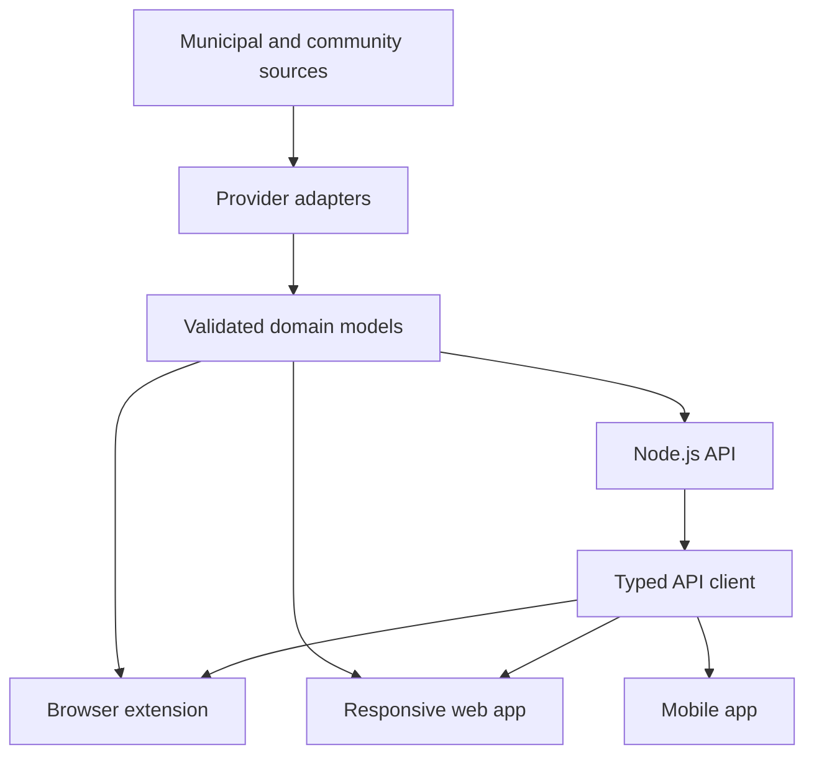
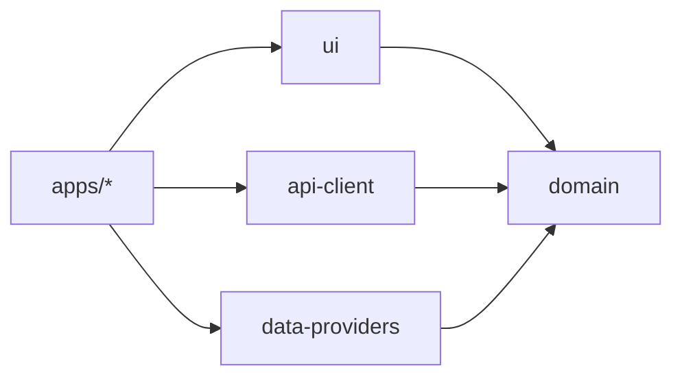

# Repository architecture

## Goals

- Keep deployable products independently buildable.
- Share stable domain, provider, API, and visual contracts without copying.
- Allow a municipal source to be added without changing product behavior.
- Preserve a clear path from local-only extension behavior to a normalized backend.

## System context



The extension initially reads a provider locally. When the API stage starts, the same normalized
domain model remains the boundary while transport and synchronization move behind `api-client`.

## Workspace ownership

| Workspace | Owns | Must not own |
| --- | --- | --- |
| `apps/extension` | Browser lifecycle, permissions, storage, alarms, popup composition | Municipal parsing or reusable domain rules |
| `apps/web` | Routes, web shell, PWA behavior, web feature composition | Browser extension APIs |
| `apps/api` | HTTP composition, persistence, jobs, provider orchestration | Product UI |
| `apps/mobile` | Native shell and native feature composition | DOM components |
| `packages/domain` | Schemas, models, pure business rules | Frameworks, I/O, municipality details |
| `packages/data-providers` | Source contracts, adapters, normalization | Product UI or persisted user settings |
| `packages/ui` | Semantic tokens and DOM React primitives | Product-specific data fetching |
| `packages/api-client` | Typed transport contract | Application state or visual behavior |
| `packages/test-utils` | Cross-workspace builders and adapters | Product-only fixtures |

## Dependency direction



Dependencies only point toward stable shared capabilities. Shared packages never import from
`apps/*`, and domain never imports another product package.

## Feature structure

Applications use feature-oriented folders inside their source root:

```text
src/
  app/          Composition, providers, routing
  features/     User outcomes and feature-specific UI
  components/   Application-only reusable presentation
  adapters/     Application runtime boundaries
  storage/      Application persistence
  test/         Application test setup
```

Do not create empty architectural layers. Add a folder when the first owned file exists.

## API composition

`apps/api` is the shared HTTP boundary described in
[ADR 0002](../decisions/0002-shared-http-api.md). Its internal structure follows three rules.

**The application factory is separate from the process entrypoint.** `buildApp` returns a configured
instance without binding a port, registering a signal handler, or calling `ready()`. Tests exercise
the real application through Fastify injection. `server.ts` owns configuration loading, listening, and
graceful shutdown.

**Cross-cutting concerns are composition functions, not encapsulated plugins.** The validator and
serializer compilers, the error boundary, and the request-identifier hook are installed on the root
instance before any route, so no plugin needs an encapsulation escape hatch. Route modules stay
ordinary Fastify plugins. `@fastify/swagger` is registered before the routes because it collects
schemas through the `onRoute` hook.

**Route schemas are the contract.** OpenAPI is generated from the runtime schemas and is never
maintained by hand. Response schemas strip undocumented fields, so a field cannot be serialized
without appearing in the contract. Documentation endpoints are toggled by configuration rather than by
route code.

Expected failures cross the boundary as RFC 9457 Problem Details from one centralized error handler.
Unexpected failures are logged in full with their request identifier and returned sanitized.

The API uses `service area` as the location-neutral transport term for the domain `District` model.
Transport naming and domain naming are allowed to differ; changing the domain model is a separate
contract-change task.

The production artifact bundles workspace packages, because shared packages publish TypeScript
sources rather than build output, and keeps only the third-party runtime packages the application
itself declares external. The build fails if any other package remains external.

## Data provider contract

Every adapter returns normalized validated data and source metadata. Provider-specific DTOs and
parsers stay inside the provider adapter. A product surface consumes normalized domain models only.

Provider failures are explicit. Fallback or cached data carries a freshness state and is never
silently presented as current official data.

`packages/data-providers` has two entry points, because the browser extension resolves its root while
official ingestion needs Node built-ins and a calendar parser:

| Entry | Contains |
| --- | --- |
| `@abfall-radar/data-providers` | Provider contracts, the demo provider, and source metadata types. Browser-safe. |
| `@abfall-radar/data-providers/node` | Retrieval, parsing, hashing, caching, and official municipal adapters. |

The root barrel never re-exports anything under `src/node/`, and a test asserts that by walking the
root export's import graph. A new municipal adapter belongs under the `./node` subpath in its own
folder, holding that municipality's names, URLs, and mappings; the retrieval, caching, identity, and
normalization modules stay manifest-driven and location-neutral.

Retrieval reads an exact allowlisted URL from a server-owned manifest. No request parameter, header, or
body may reach it, so the server-controlled catalogue remains the whole security model rather than one
layer of it.

`apps/api` orchestrates: it resolves a provider and a service area, filters the requested range, maps
domain names onto transport names, and translates failures into Problem Details. It does not parse a
calendar format and does not know a municipal host.

An adapter's external dependencies — `fetch` and a clock — are injected with the real implementations as
defaults, so failure, staleness, and expiry are testable without a network, a wait, or a
production-only switch.
