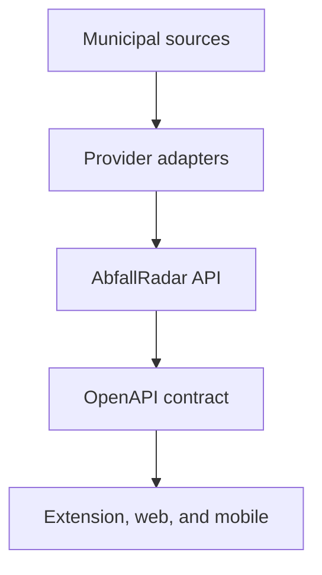

# ADR 0002: Use a documented Fastify API as the shared client boundary

- Status: Accepted
- Date: 2026-07-28

## Context

AbfallRadar has a browser extension foundation and is expected to add a responsive web application
and an optional mobile application. All clients need the same provider-neutral collection data,
source provenance, freshness information, and error semantics.

Municipal sources vary by city, format, availability, and update schedule. Letting each client call
and parse those sources would duplicate provider logic, increase browser permissions, expose
upstream instability to product surfaces, and make contract evolution difficult.

The project also needs an API reference that humans and coding agents can inspect visually,
machine-readable contracts for client generation, and explicit documentation of expected failures.

## Decision

Use a shared REST API under `apps/api` as the only municipal-data boundary for browser, web, and
mobile clients.

### Runtime and framework

- Run the API on Node.js 24.
- Use Fastify 5 as the HTTP framework.
- Use strict TypeScript and Zod 4 schemas through the Fastify Zod type provider.
- Keep application construction separate from process startup so tests can use Fastify injection
  without opening a network port.
- Use Fastify's structured Pino logging, request identifiers, environment validation, and graceful
  shutdown.

### Contract and documentation

- Expose product endpoints below `/api/v1`; keep operational health endpoints unversioned.
- Define request and response schemas next to their routes.
- Generate OpenAPI from the runtime route schemas. The generated specification is authoritative and
  must not be maintained manually in parallel.
- Serve interactive Swagger UI at `/docs` and the machine-readable OpenAPI document at
  `/openapi.json` in development.
- Document successful responses and every expected error response with realistic examples.
- Generate `@abfall-radar/api-client` from the OpenAPI document when the first product client is
  migrated to the API.

The `v1` segment versions the public HTTP contract. It is not part of the product name or release
artifact name.

### Error contract

Return expected API failures as `application/problem+json` using RFC 9457 Problem Details. Use the
standard `type`, `title`, `status`, `detail`, and `instance` members and the following stable
extensions:

- `code`: a machine-readable AbfallRadar error code;
- `requestId`: the request identifier used to correlate client errors with server logs;
- `errors`: optional field-level validation details that do not expose implementation internals.

Use an owned URI or an AbfallRadar URN for each problem type. Do not publish a documentation URL
under a domain the project does not control.

Do not return stack traces, upstream response bodies, credentials, or private infrastructure details
to clients.

### Dependency boundaries

- `apps/api` owns HTTP composition, configuration, error translation, provider orchestration, and
  future persistence.
- `packages/data-providers` owns municipal source adapters and normalization.
- `packages/domain` owns framework-independent collection models and business rules.
- `packages/api-client` owns generated transport contracts and request functions.
- Extension, web, and mobile applications consume `@abfall-radar/api-client`; they do not parse
  municipal formats or depend on provider-specific fields.

### Persistence and external access

Do not select a database, distributed cache, authentication system, or deployment platform in the
API foundation task. Add each only when a concrete vertical slice defines its data lifecycle and
operational requirements.

Browser clients will eventually request access only to the AbfallRadar API origin. Municipal host
permissions remain a server-side concern. CORS origins must be explicit and environment-specific;
do not use an unrestricted production wildcard.

## Consequences

### Positive

- all product clients receive one stable, validated contract;
- provider-specific changes remain behind the API boundary;
- known errors and examples are visible and machine-readable;
- generated clients reduce drift between server and consumers;
- clients need fewer external host permissions;
- upstream caching and resilience can evolve independently of product releases.

### Trade-offs

- the extension depends on API availability for fresh data;
- the API requires deployment, monitoring, security updates, and operational ownership;
- OpenAPI generation and client generation must be verified in CI;
- cached or stale data must remain available when an upstream provider fails.

## Alternatives considered

### Clients call municipal sources directly

Rejected because it duplicates parsing, increases browser permissions, complicates mobile and web
clients, and exposes each client to upstream changes.

### NestJS

Not selected for the initial service because its dependency-injection and decorator architecture add
more framework surface than the current read-oriented API needs. Fastify provides the required
validation, plugin boundaries, logging, testing, and OpenAPI integration with less application
boilerplate.

### Express

Not selected because schema validation, response serialization, structured logging, and OpenAPI
integration would require more independently assembled conventions.

### Handwritten OpenAPI as a separate source of truth

Rejected because separately maintaining route behavior, TypeScript types, runtime validation, and an
OpenAPI document creates avoidable contract drift.

### GraphQL

Not selected because the first product use cases are cacheable resource reads with simple request
shapes. REST and OpenAPI provide a smaller operational and tooling surface.
