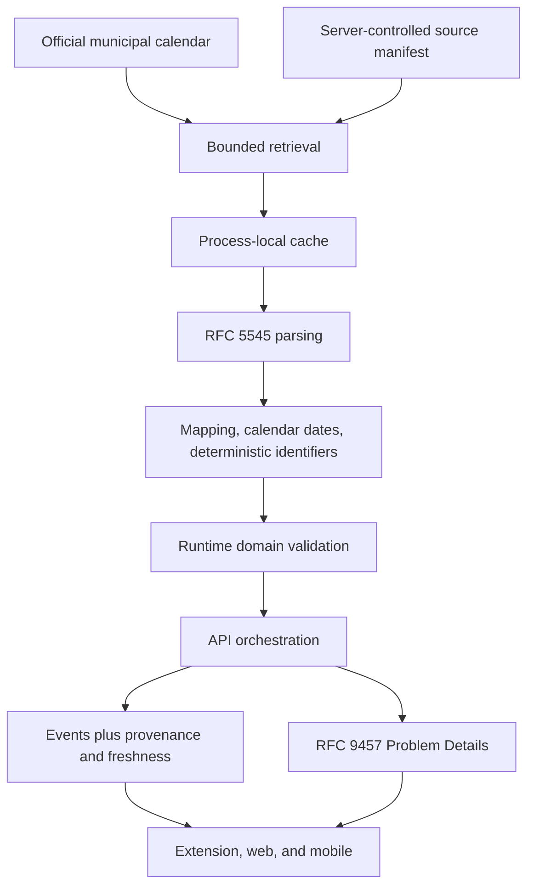

# ADR 0003: Ingest official collection schedules server-side from allowlisted calendar sources

- Status: Accepted
- Date: 2026-07-29

## Context

AbfallRadar has a browser extension foundation ([ADR 0001](0001-monorepo.md)) and a documented HTTP
API ([ADR 0002](0002-shared-http-api.md)), but every schedule it can serve today is generated demo
data. The product exists to answer one question — which bin goes out on which day — and that answer
is only useful when it comes from the responsible municipal authority.

The first official source is the Koblenz municipal waste operator, which publishes downloadable
calendar files per collection area:

- <https://servicebetrieb.koblenz.de/abfallwirtschaft/entsorgungstermine-digital/>
- <https://servicebetrieb.koblenz.de/downloads/broschueren/ksk-abfallratgeber-26-ai.pdf?cid=3mpk>

Four constraints shape this decision.

**The product stays location-neutral.** `docs/ai/shared-rules.md` requires that product UI and
`packages/domain` never depend on a city's names, URLs, calendar formats, or administrative
hierarchy. A municipal integration is an adapter, not a product feature.

**Municipal sources are untrusted and unstable.** A published calendar file is external input of
unknown size, encoding, and structure. Its URL, its event wording, and its area boundaries can
change without notice or versioning, and the site can be slow or unreachable.

**Official data must never be confused with anything else.** The shared rules forbid presenting
demo, cached, stale, estimated, or community data as official current data, and require that source,
retrieval time, validity, and freshness travel with the data.

**Reuse terms are not yet recorded.** The calendar files are publicly downloadable, but public
availability is not a licence to redistribute a dataset from a hosted service.

## Decision

Ingest official collection schedules exclusively on the server, from exact allowlisted HTTPS
calendar URLs held in a server-controlled source catalogue, and expose the result through the
versioned HTTP contract as normalized events plus explicit provenance.

### Server-controlled source catalogue

The set of ingestible sources is data the server owns.

- A client may select a provider identifier and a service-area identifier. A client may never
  supply, influence, or override an upstream URL, host, or path. There is no proxy, no URL
  parameter, and no request header that reaches the retrieval boundary.
- The first official provider identifier is `koblenz-servicebetrieb`. The existing `demo` provider
  keeps its identifier and behavior.
- Each entry of the catalogue is a **source manifest** that declares, per service area: the exact
  allowlisted HTTPS calendar URL, the allowed origin as scheme, hostname, and effective port, the
  official area name and the derived service-area identifier, the human-readable source name, the
  public landing page used for attribution, the validity window the file covers, the accepted
  response content types, and the waste types the source actually contains.
- Manifest values are recorded from a manual verification of the real source. They are never
  inferred from a URL pattern, a naming convention, or another area's entry.

### Verified first source

The first manifest entry was verified by hand on 2026-07-29 against the live source. The stable
no-query URL is the manifest value:

```text
https://servicebetrieb.koblenz.de/abfallwirtschaft/entsorgungstermine-digital/entsorgungstermine-2026-digital/ics-stadtmitte.ics
```

| Observation | Value |
| --- | --- |
| Approved origin | `https://servicebetrieb.koblenz.de`, effective port 443 |
| Redirect | one hop, same origin and pathname, adds a `cid` query parameter |
| Final status | `200` |
| Content type | `text/calendar`, with no `charset` parameter |
| Body size | 22301 bytes |
| Declared zone | Exactly one `X-WR-TIMEZONE: Europe/Berlin`, with no `VTIMEZONE` component and no `TZID` parameter |
| Upstream entries | 46 `VEVENT` entries in total: 44 all-day and 2 timed, with no `RRULE` |
| Normalized result | 48 collection events: 44 all-day, plus 4 timed from the 2 combined entries |
| Waste types | `paper`, `yellow_bag`, `green_waste`, `christmas_tree`, `hazardous`, `small_electronics` |
| Not covered | `residual`, `bio` |

The `cid` value and the matching `ETag` are observations of one retrieval. Neither belongs in the
manifest or the public contract, because both are volatile.

The official area name and the validity window are recorded as derived from the URL path and the
landing page rather than read from the payload: the file's `X-WR-CALNAME` is the single character
`2`, so it attests neither. The file is a third-party calendar export, which makes its wording and
structure less stable than a purpose-built municipal feed and is one more reason ingestion fails
loudly on unrecognized input.

### Ingestion boundary

- Retrieval uses the exact URL from the manifest. URL patterns are never constructed or guessed.
- Runtime HTML scraping and runtime PDF scraping are prohibited. The published PDF guide is a
  document for humans verifying the source; it is not a runtime input.
- RFC 5545 parsing uses the maintained `node-ical` library, version `0.27.1`, as a runtime
  dependency of `packages/data-providers`. Only its string-parsing API is used. Library helpers that
  fetch a URL are not used, because retrieval must stay inside the bounded, allowlisted boundary
  described below.
- HTTP retrieval uses the Node 24 built-in `fetch`, reached through an injectable boundary so tests
  never touch the network and no test fixture is a downloaded municipal file.
- Node-specific provider code is reachable only through an explicit `./node` subpath export of
  `@abfall-radar/data-providers`. The package root export stays browser-safe, so nothing in this
  decision enters the browser extension dependency graph.

### Ownership of each step

Bounded retrieval, caching, RFC parsing, normalization, and runtime validation belong to the
provider adapter, because `docs/architecture/repository-structure.md` makes every adapter
responsible for returning validated data together with its source metadata and an explicit freshness
state.

`apps/api` orchestrates: it resolves provider and service area, filters the requested date range,
maps domain names onto transport names, and translates failures into Problem Details. It does not
parse calendar formats and it does not know a municipal host.

The provenance, freshness, coverage, and upstream-failure types live in `packages/data-providers`. A
location- and transport-neutral domain has no reason to learn about retrieval metadata before a
second consumer needs it.

`packages/domain` does change, minimally. The normalized collection event becomes a closed set of
variants rather than a flat record with optional extras, because the verified official source
contains a timed mobile drop-off that a date-only model cannot represent faithfully. The waste
vocabulary and the existing `source: 'municipal_ics'` value are unchanged, and the demo provider
gains the same explicit all-day and curbside metadata without any change to product behavior.

### Normalization

- An official event summary is mapped to a `WasteType` through a mapping table that lives inside the
  Koblenz adapter. The domain waste vocabulary does not change.
- A single official entry may normalize into more than one collection event when it announces more
  than one collection, for example hazardous waste together with small electronics.
- A normalized event is one of a closed set of variants, discriminated by its collection mode.
  Timing, mode, and location are not independent optional fields: an incomplete combination must be
  unrepresentable, not merely discouraged. There is no implicit default either, because an absent
  timing would have to be inferred, and avoiding inference is why this decision exists.
- **All-day curbside collection.** An all-day `VALUE=DATE` entry yields
  `collectionMode: "curbside"` with an `all_day` timing and no location. The calendar date is
  preserved exactly, with no conversion through UTC or a local time zone that could shift it by a
  day.
- **Timed mobile drop-off.** An entry with start and end instants yields
  `collectionMode: "mobile_drop_off"` with a `time_window` timing carrying `startsAt`, `endsAt`, and
  `timeZone`, and a required non-empty location name. The window, the zone, the mode, and the
  location are official semantics; reducing such an entry to a bare date would discard them.
- Validation therefore rejects a mobile drop-off without a window or without a location, and a
  curbside collection carrying a window or a location, rather than accepting a half-populated event
  that a product surface would render as an actionable instruction it cannot fulfil.
- The calendar's declared zone is validated before any timed event is normalized. The file must
  carry exactly one usable declared zone, and it must equal the zone the manifest records. A
  missing, empty, duplicated, malformed, or mismatching declaration fails the refresh. The
  manifest zone is never used as a fallback for a file that does not attest it: falling back would
  apply an assumption the source has stopped supporting, which is precisely how every date in a
  schedule shifts by a day without anyone noticing. The manifest value is the expectation to check
  against, not a default to substitute.
- The top-level date of a timed event is derived in that validated zone, using `Intl.DateTimeFormat`
  with `formatToParts` and reading the `year`, `month`, and `day` parts. A formatted string is never
  parsed, and the calendar and numbering system are pinned, so no locale can change the result.
  Deriving the date in UTC or in the server's local zone would silently shift it for any window near
  midnight.
- The timing form follows the calendar value type and the collection mode follows the mapping table.
  When the two disagree, or when an upstream entry cannot produce one of the valid variants, the
  refresh fails: the source has changed in a way the mapping no longer describes.
- Official area naming is preserved. Existing demo identifiers are not forced onto official data
  when the official source uses different boundaries or different names. Where the two disagree, the
  official naming wins and the demo entry is left alone.

### Event identity

A normalized event is identified by what it is, not by where it sits in a calendar file. Identity is
a nine-member tuple, in this fixed order, with absent members as explicit nulls:

1. `providerId`
2. `serviceAreaId`
3. `wasteType`
4. local `date`
5. timing kind
6. `startsAt`, or null
7. `endsAt`, or null
8. `timeZone`, or null
9. normalized location name, or null

An all-day event therefore carries nulls in members 6 to 9.

`collectionMode` is deliberately not a tenth member. The closed variant set makes it a function of
the timing kind — `all_day` implies curbside and `time_window` implies mobile drop-off — so
including it could only ever restate what member 5 already fixes.

- The canonical representation is a JSON array of those nine members in that order. JSON escaping
  keeps the encoding unambiguous for arbitrary official text, which a delimiter join would not,
  because a location name may itself contain the delimiter.
- Instants are serialized in one UTC form. A location name is trimmed, its internal whitespace
  collapsed, and Unicode NFC applied, because the same official name otherwise hashes differently
  depending on how the source encoded its diacritics.
- The zone belongs in the tuple even though the instants are absolute. Two windows can name the same
  pair of instants under different zones, and those are different events to the person reading them:
  the local time they are told to show up, and the daylight-saving rules that move it, both come
  from the zone. Leaving it out would let a zone correction pass unnoticed as the same identifier.
- The identifier is a readable `providerId-serviceAreaId-wasteType-date` prefix followed by a
  truncated SHA-256 digest of that canonical representation, computed inside the Node subpath so no
  hashing dependency reaches the browser graph.
- The identifier is opaque. Clients must not parse it; the prefix exists for operator readability.
- Two events that differ in timing, zone, or location therefore receive different identifiers, and
  both are returned. Only fully identical normalized events collapse. A date-only identifier would
  have forced a choice between dropping one of them and failing an entire refresh over an avoidable
  collision, and one waste type can legitimately have more than one window or location in one area
  on one local date.
- The upstream `UID` is never part of the public contract and never an identity input. It may be
  logged as untrusted source metadata only. Identity must stay deterministic without it, because one
  upstream entry can produce two events and an upstream identifier can change between refreshes.
- The demo provider keeps its existing readable identifiers. Hashing is specified for official
  providers, so demo identifiers stay stable and no product surface changes.

### Trust boundaries

Every byte from a municipal host is untrusted input and crosses four checks before it becomes a
response.

| Boundary | Rule |
| --- | --- |
| Retrieval | A 5-second deadline for the whole retrieval; 1 MiB response-body limit; only the manifest origin is allowed |
| Redirects | At most 3 hops, each keeping HTTPS, the exact manifest hostname, and the manifest effective port |
| Content type | Only the narrow content-type set observed and recorded during source verification is accepted |
| Calendar zone | Exactly one usable declared zone, and it must equal the manifest zone |
| Structure | RFC 5545 parsing, then runtime domain validation of every normalized event |

The allowlist is an **origin**, not a hostname. The initial manifest URL and every redirect target
must match the approved scheme, hostname, and effective port. A hop that downgrades to HTTP, moves
to another hostname, or moves to another port is refused rather than followed, and the retrieval
fails as an unavailable source. Pinning only the hostname would leave two real holes: a downgrade to
HTTP puts the payload and its integrity in the hands of whoever is on the path, and a port change
reaches a different service on the same name. Neither is something a municipal calendar redirect
legitimately needs.

Redirects are also **bounded**. Because they are followed manually, the chain has to be limited
explicitly: at most 3 hops, with a repeated target treated as a loop. Exceeding the limit or
detecting a loop stops the retrieval and fails as an unavailable source. The 5-second budget is a
deadline for the entire retrieval rather than a fresh timeout per hop, so a chain of individually
fast responses cannot add up to an unbounded wait. The verified source uses one hop, so the limit
leaves room for the operator to add a hop without an outage while still refusing an endless chain.

An invalid or unmapped official summary fails the refresh. Ingestion never silently drops an entry
it does not understand, because a partial schedule is indistinguishable from a complete one to a
user and would be the most damaging possible failure mode. A previously retrieved valid value may
still be served while the refresh is failing.

### Caching and freshness

Each source gets a process-local cache entry:

- a fresh time-to-live of 6 hours;
- a stale-if-error maximum of 7 days;
- coalesced concurrent refreshes, so simultaneous requests for one source cause one upstream
  request;
- the timestamp of the last successful retrieval, preserved across failed refreshes.

A failed refresh may serve an existing valid value with `freshness: "stale"` and a structured
warning log. Stale data is never manufactured: when no successful retrieval has ever produced a
value, the request fails instead of returning something labelled stale.

Waste-type coverage is declared by the manifest. It is never inferred from the absence of events,
because an empty result can mean "no collection in this range" or "this source does not contain this
waste type", and those must not be conflated.

### HTTP surface

One resource is added to the versioned contract:

```text
GET /api/v1/providers/{providerId}/service-areas/{serviceAreaId}/collection-events
    ?from=YYYY-MM-DD&to=YYYY-MM-DD
```

- `from` and `to` are required ISO calendar dates, `from` is not after `to`, and the inclusive range
  is at most 366 days.
- The transport uses `serviceAreaId` and `wasteType`. Provider-specific calendar fields — `UID`,
  `DTSTAMP`, `DESCRIPTION`, `SUMMARY` internals, recurrence rules — are not exposed.
- Each event carries its normalized timing, collection mode, and location name, because a person
  deciding what to do with a collection needs to know whether to put a bin out for the day or to
  bring something to a place inside a time window. The contract documents these as a discriminated
  set of variants, so a client can handle them exhaustively instead of guessing which fields travel
  together.
- A response carries the normalized events plus source name, retrieval time, source validity window,
  freshness state, and the explicitly declared waste-type coverage.
- Public attribution links the official landing page. The direct calendar download URL is not part
  of the public API contract, so the project can change how it retrieves a source without breaking a
  client and does not advertise a deep link into municipal infrastructure.

### Data flow



Bounded retrieval enforces the timeout, the body limit, and the origin allowlist. The cache enforces
the fresh time-to-live, stale-if-error, and refresh coalescing. API orchestration filters the
requested range and maps domain names onto transport names.

## Consequences

### Positive

- clients receive official dates through one contract, with no municipal host permission, no
  calendar parser, and no upstream instability of their own;
- a municipal quirk stays in one adapter, so the product and the domain remain location-neutral;
- provenance and freshness travel with the data, so a surface can label what it shows honestly;
- the allowlist plus the bounded retrieval boundary means a compromised or slow municipal host
  cannot turn into a request-forgery vector, a memory exhaustion vector, or an indefinite hang;
- caching keeps the API responsive and keeps request volume against a municipal host low;
- because an unmapped entry fails loudly, an upstream wording change is a visible error rather than
  a silently shortened schedule.

### Trade-offs

- the API depends on the availability of a municipal host for fresh data;
- an exact URL per service area does not scale by convention: adding an area is a verification step,
  not a configuration guess;
- a process-local cache is lost on restart and is not shared between instances, so a horizontally
  scaled deployment multiplies upstream requests;
- `node-ical` and its transitive dependencies are bundled into the API production artifact, which
  enlarges it and puts a third-party parser inside the trust boundary;
- strict failure on unknown input means an upstream wording change causes an outage for that source
  until the mapping is updated, rather than degraded output;
- the verified source is a third-party calendar export rather than a purpose-built municipal feed,
  so its wording and structure can change for reasons unrelated to waste collection;
- identifiers carry a hash, so they cannot be read as a date-and-type pair while debugging, and an
  occurrence that the source moves or re-times is a new identifier rather than an edited one;
- two timing forms mean every consumer has to handle both, instead of treating a schedule as a flat
  list of dates.

## Alternatives considered

### Clients parse municipal calendars themselves

Rejected. It would require municipal host permissions in the extension, duplicate the parser across
extension, web, and mobile, expose every client release to upstream changes, and make the "never
present partial data as complete" rule unenforceable across surfaces. ADR 0002 already rejected this
for the same reasons.

### Request-time HTML or PDF scraping

Rejected. The landing page and the printed guide are presentation artifacts for humans. Their markup
and layout change for editorial reasons, so a scraper turns an editorial change into a data
incident. Both are also far weaker sources than a structured calendar file: the PDF states general
odd/even week rules and holiday shifts in prose, which is not a schedule for a specific area.

### Client-supplied upstream URLs

Rejected. Accepting a URL from a client makes the API a request-forgery proxy into any network it
can reach, makes the response impossible to attribute or validate against a known manifest, and
moves the trust boundary to the least trustworthy participant. The server-controlled catalogue is
the entire security model.

### Committed official snapshots

Rejected. Committing a downloaded municipal calendar puts a third-party dataset in the repository
with no recorded reuse terms, guarantees the data ages into being wrong, and creates a schedule that
looks official while nothing refreshes it. Tests therefore use small synthetic fixtures written for
this project.

### Handwritten ICS parsing

Rejected. RFC 5545 is not a line-oriented format that a small reader can honestly approximate: line
folding, escaping, character sets, value types, time-zone components, and recurrence rules are all
places where a naive parser silently produces a plausible wrong date. A maintained parser is the
safer dependency, and it is confined behind the adapter so it can be replaced.

## Unresolved operational risks

- **Source reuse terms are unrecorded.** Public deployment or redistribution of municipal datasets
  stays out of scope until reuse terms are established and written down. Public availability of a
  file is not a licence, and this decision must not be read as granting one.
- **Residual and bio schedules are not solved.** The official 2026 guide expresses these as general
  odd/even week rules with holiday shifts rather than as per-area dates. This decision does not
  generate or estimate them; an estimated date would be exactly the kind of unofficial data the
  shared rules forbid presenting as official.
- **Coverage is intentionally narrow.** The first implementation proves the path with at least one
  manually verified official collection area. Cataloguing every Koblenz area is later work, and
  until then the API must not imply that unlisted areas are unsupported by the municipality rather
  than merely unverified here.
- **Scaling changes the caching decision.** A shared cache, a scheduled refresh job, or persistence
  becomes necessary once more than one instance runs; ADR 0002 deliberately deferred that choice to
  a slice that defines its data lifecycle.
- **Upstream fragility is accepted, not eliminated.** A changed URL, a renamed area, or new event
  wording breaks one source loudly. Monitoring that surfaces the resulting structured warnings and
  errors is not part of this decision.
