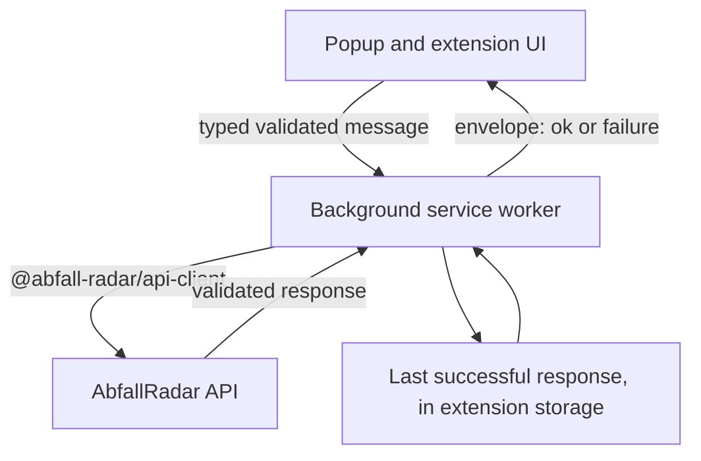

# ADR 0004: Connect the browser extension to the shared HTTP API through a worker-owned boundary

- Status: Accepted
- Date: 2026-07-30

## Context

AbfallRadar has a documented HTTP contract ([ADR 0002](0002-shared-http-api.md)) that serves
official municipal collection schedules ingested server-side from an allowlisted calendar source
([ADR 0003](0003-official-schedule-ingestion.md)). The browser extension has not moved with it.
`apps/extension/entrypoints/popup/App.tsx` still calls `createDemoSchedule` and `demoDistricts`
directly, and `apps/extension/entrypoints/background.ts` still reads `demoScheduleProvider` to
decide what to remind a person about. Official data therefore exists and reaches nobody, while the
one product surface a user actually opens keeps showing generated sample data where a municipal
schedule belongs.

`packages/api-client` is still a reserved stub: a `package.json` with no `exports`, no `scripts`,
and no dependencies, plus a placeholder README. Both ADR 0002 and
[the repository architecture](../architecture/repository-structure.md) reserve it as the typed
transport boundary for the extension, the web application, and the mobile application, so activating
it is a decision about all three clients rather than about one popup.

Six constraints shape this decision.

**The extension must not become a second ingestion path.** ADR 0002 and ADR 0003 both rejected
clients reading municipal sources directly: it would duplicate the parser, require a municipal host
permission, expose every extension release to upstream changes, and make the rule that partial data
is never presented as complete unenforceable across surfaces.

**Manifest V3 has one place where a network boundary belongs.** The background service worker owns
lifecycle, storage, and alarms. A popup is a short-lived window that can be closed mid-request, and
letting each UI surface issue its own requests would scatter the timeout, retry, cache, and error
policy across components that disappear.

**There is no deployed API and no production domain.** A base URL has to be configurable, must
default to something honest for local development, and must not invite a fabricated production host
into the repository. Chrome host permissions are static manifest content, so they have to be derived
from the same configuration.

**Provenance has to survive the extra hop.** ADR 0003 makes every response carry its source,
retrieval time, validity window, freshness state, and declared waste-type coverage precisely so a
surface can label honestly what it shows. A client-side cache adds a second, independent kind of
staleness on top of the server's, and both have to reach the user without either being relabelled as
fresh.

**A schedule is a municipal calendar, not a device calendar.** "Today" for a collection schedule is
today in the zone the source publishes in. Deriving it from the browser zone would shift the whole
window for anyone whose device is set elsewhere, which is the same class of error ADR 0003 already
guards against server-side.

**The extension already has persisted settings that name a demo district.** The stored shape is
unversioned and its default `districtId` is `koblenz-stadtmitte`. Existing installations must move
to a provider-and-area selection without a schema migration inventing an official identifier that
nobody verified.

## Decision

Migrate the extension to consume the AbfallRadar HTTP API exclusively, through a browser-safe
`@abfall-radar/api-client` package, behind a network boundary owned by the Manifest V3 background
service worker.

### The extension is a pure API client

- The extension never retrieves, parses, or interprets a municipal calendar. Its only data boundary
  is the AbfallRadar HTTP API.
- `@abfall-radar/data-providers` leaves the extension's dependency graph entirely. Nothing under
  that package's `./node` subpath was ever reachable from the extension, and now neither is its
  browser-safe root: demo schedules stop being a product surface concern.
- No municipal host permission is requested, because no municipal host is contacted.

### The service worker owns the network boundary

- Only the background service worker constructs a request. The popup and every future extension UI
  surface reach it through a typed message contract.
- The contract is validated at runtime on both sides. A message crosses a process boundary, so it is
  untrusted input by the rule in [the shared rules](../ai/shared-rules.md) even though both sides
  ship in the same artifact.
- The handler answers with `sendResponse` and returns `true`. This is the selected compatibility
  baseline for the Chrome versions this project supports, not a claim about what Chrome will or will
  not support in future: a promise-returning listener is a viable alternative the moment the
  supported baseline makes it uniformly available.
- No rejection escapes the handler. Every path — success, expected failure, unexpected failure,
  unrecognized message — answers with an envelope, because a dropped `sendResponse` leaves the popup
  waiting on a reply that never arrives.
- The boundary is enforced mechanically, not by convention: a test walks the popup entry's import
  graph and fails if `@abfall-radar/api-client` is reachable from it.

### `@abfall-radar/api-client` is browser-safe and transport-only

- The package declares `zod` as its only runtime dependency. It imports no Fastify, no `node:*`
  built-in, no `@abfall-radar/data-providers`, and nothing from `apps/api`.
- It deliberately does **not** depend on `@abfall-radar/domain`. Transport models and domain models
  stay separate: the client owns the wire shape, the domain owns the business model, and neither is
  expressed in terms of the other. The duplication this creates in the transport vocabulary is made
  safe by the compile-time compatibility check described below, which pins every validator to the
  generated type that OpenAPI produced.
- The guard in `packages/data-providers/src/browser-boundary.test.ts` is the reference for the
  package's own import-graph test, which asserts the full set of bare specifiers rather than only
  the absence of a few known-bad ones.
- The package owns transport contracts and request functions. It owns no application state, no UI
  behavior, no retry policy tied to a product decision, and no cache.

### The contract stays generated; validation is hand-written and narrow

OpenAPI remains the canonical transport contract, as ADR 0002 requires. This decision does not
narrow that statement.

- TypeScript types for `@abfall-radar/api-client` are **generated** from the OpenAPI document.
  Generated files are never edited by hand.
- Runtime **validators are hand-written**, in Zod, and scoped to the untrusted HTTP boundary only —
  the three responses this client reads plus RFC 9457 Problem Details. They exist because generated
  types vanish at runtime, and the shared rules require external data to be parsed rather than
  asserted.
- Validator output is checked against the generated response types **at compile time**, so the two
  representations cannot drift apart silently. A validator that stops matching its generated type is
  a type error, not a runtime surprise.
- A **deterministic drift check** runs as part of the ordinary test suite: it rebuilds both
  generated artifacts and fails if either committed artifact is stale.
- Generation never depends on a manually running development server. The contract is produced by
  building the Fastify application in process and reading its generated document; nothing listens on
  a port.

Ownership follows the contract. `apps/api` owns emission, because it owns the contract: one script
builds the application, writes the committed OpenAPI document, and runs the type generator to write
the committed generated module inside `packages/api-client`. The dev-time coupling therefore points
from an application to a package, which
[the dependency direction](../architecture/repository-structure.md) allows. The inverse — a script
inside `packages/api-client` reaching into `apps/api` — was rejected because it would make a shared
package's tooling depend on an application's layout, which is the one direction the architecture
forbids.

### Transport-to-domain mapping is explicit and validated

A transport event is mapped onto the domain `CollectionEvent` by a named adapter inside the
extension, which renames `serviceAreaId` to `districtId` and `wasteType` to `type` and validates the
result through `CollectionEventSchema`. Nothing is inferred and nothing is cast.

This keeps `getUpcomingEvents`, `findReminderEvent`, and `getRelativeDateLabel` working unchanged,
and keeps `DashboardView`'s existing props intact, so the responsive popup this project already
reviewed is preserved rather than rebuilt. The adapter stays in the extension until a second
consumer exists, per the rule that a shared abstraction waits for a real second consumer.

### Base URL configuration

- The base URL is **build-time configuration only**. There is no user-editable API URL, no settings
  field, and no runtime override. A user-supplied URL would make the extension a request-forgery
  surface and would make every response impossible to attribute, which is the same reasoning ADR
  0003 applied to client-supplied upstream URLs.
- `WXT_API_BASE_URL` is validated and normalized at build time. It must be an **origin only**:
  scheme, host, and optional port, with no credentials, no path, no query, and no fragment. A value
  carrying any of those is a configuration error that fails the build rather than being silently
  trimmed.
- Unset, the value defaults to `http://127.0.0.1:3000`, which is exactly where `apps/api` listens by
  default. The loopback literal is used rather than `localhost` so no name resolution can send the
  request to an address the API is not bound to.
- A **release or package build fails** unless `WXT_API_BASE_URL` is explicitly supplied and is a
  non-loopback HTTPS origin. Shipping a development configuration is therefore not possible.
  `WXT_RELEASE` marks that controlled release path and belongs to the release workflow alone; it is
  documented as such and is never set for ordinary development or CI verification.
- **No production domain is invented or committed.** There is nothing to name yet, and a placeholder
  host in a manifest is indistinguishable from a real one to everything that reads it.

### Host permissions

- Exactly one `host_permissions` match pattern is derived from the validated origin. The permission
  set otherwise stays `alarms`, `notifications`, and `storage`.
- No `<all_urls>`, no `optional_host_permissions`, no `tabs`, and no `activeTab`.
- **A Chrome match pattern cannot express a port.** The pattern derived from `http://127.0.0.1:3000`
  grants the host, not the port. The port is still enforced where it can be: every request is built
  from the exact configured base URL, so the extension never contacts another port even though the
  permission would technically allow it. Recording this openly matters more than implying a narrower
  grant than Chrome can represent.
- Because an extension-initiated request from the service worker carries its host permission, the
  API's CORS configuration is unchanged by this decision.

### Data flow



The extension reads three resources:

1. `GET /api/v1/providers` — the provider catalogue. A provider whose `sourceKind` is `demo` is not
   offered, because demo data must never appear on a surface a person reads as official.
2. `GET /api/v1/providers/{providerId}/service-areas` — the areas of the selected provider. Each
   area states its collection-events capability explicitly:

   ```ts
   collectionEvents:
     | { availability: 'available'; timeZone: string; validity: { from: string; to: string } }
     | { availability: 'unavailable' }
   ```

   This is an **additive contract change** to an existing resource, decided here because the client
   cannot otherwise request a correct range: the validity window was previously visible only on a
   collection-events response, which is the request it is needed to construct. A capability union is
   used rather than nullable date fields so "this provider publishes no official calendar for this
   area" cannot be confused with "a value is missing". A demo area reports `unavailable` and carries
   no invented zone or window — though a demo provider is filtered out one step earlier, so the
   extension never requests or renders its areas at all.
3. `GET .../collection-events?from&to` — the events in an explicit bounded range.

#### An unavailable area is visible, explained, and not selectable

Two exclusions operate at different levels, and they must not be confused.

**A demo provider is filtered out entirely**, at the catalogue. It is never offered, so none of its
areas is ever listed, reachable, or rendered on the selection surface — the question of how they
would appear does not arise. That is a stronger exclusion than unselectability, applied earlier, and
it is the reason a demo area's `unavailable` capability is never what a user sees.

**Within an offered provider**, an area whose capability is `unavailable` is a different case: the
provider is legitimate and the area exists, but this source publishes no calendar for it.
`availability: 'unavailable'` is a statement about the source, not about the area's existence, so
the area stays in that provider's list. What it must not do is become a selection, because a
selection it cannot serve would produce a permanent empty dashboard that reads as "no collections
scheduled here".

Everything below therefore describes an unavailable area **of an offered, non-demo provider**.

- It **remains visible with an explanatory label** saying the provider publishes no official
  calendar for it. Hiding it would imply the municipality does not serve the area, which is a
  different and unfounded claim.
- It **cannot be selected or confirmed**, and it **cannot be persisted** as a new selection. The
  storage repository refuses it, so the guarantee does not rest on the UI alone.
- It **causes no collection-events request and no reminder**. There is nothing to request and
  nothing to remind about.
- Its unselectability is **conveyed through disabled semantics**, not through appearance. A greyed
  row that still activates on Enter, or that a screen reader announces as an ordinary option, is the
  failure mode being ruled out: the control must report its disabled state to assistive technology
  and must not be operable by pointer or keyboard.

**A persisted selection that becomes unavailable is invalidated.** When a successful capability
refresh reports `unavailable` for the area currently stored, that selection stops being valid: its
cached schedule stops being presented, no schedule request is issued, and no reminder fires. The
user is returned to the needs-selection state rather than left looking at a schedule for an area the
operator has stopped publishing. This is the one case where the extension discards a choice the user
made, and it does so because continuing to honour it would mean presenting withdrawn data as
current.

### The requested range is derived in the source's zone

- The current date is derived **in the zone the capability declares**, never from the browser or
  device zone, using `Intl.DateTimeFormat` with `formatToParts` and reading the `year`, `month`, and
  `day` parts with the calendar pinned to `gregory` and the numbering system to `latn`. A formatted
  string is never parsed. This mirrors the rule ADR 0003 already applies when it derives a timed
  event's local date server-side.
- The window is 90 calendar days forward from that derived date, computed as calendar arithmetic on
  the derived date so no ambient zone can shift it.
- The range is clamped into the declared window: `from` is the later of today and `validity.from`,
  `to` is the earlier of today plus 90 days and `validity.to`.
- When the derived today is past `validity.to`, or the clamp inverts, **no request is issued** and
  the UI states that the source publishes no calendar for the current period. Guessing a narrower
  range, or retrying until something answers, would be exactly the kind of inference this project
  keeps out of scheduling data.
- `422 SCHEDULE_RANGE_NOT_COVERED` is still handled, because the declared window can change between
  listing an area and requesting its events.

**The zone and the window are not only available live.** A cached collection-events response already
carries `meta.source.timeZone`, `meta.validFrom`, and `meta.validTo`, all of them validated when the
response was stored. That is the same information the capability publishes, so a cached entry is its
own **last-known capability snapshot** and no second persisted representation is introduced. Startup
therefore never has to reach the network before it can decide what a cached schedule covers, which
is the whole point of caching it.

### Response validation is forward-compatible

- Every API response validator **requires and validates every known contract member** and
  **tolerates unknown members by stripping them**. An additive server field must not break an
  extension that is already installed, and an installed extension must not forward a field it does
  not understand into a cache or a UI.
- Internal message envelopes and persisted storage schemas are **strict** instead. Both sides of
  those boundaries ship in one artifact, so an unexpected member there is a defect rather than a
  newer contract.
- One limit is accepted rather than papered over: a genuinely new `collectionMode` variant fails
  validation. ADR 0003 chose a closed variant set precisely so that adding one is a contract change
  for every client, and a loud failure is the intended cost of making an incomplete event
  unrepresentable.

### RFC 9457 Problem Details

- The client validates the whole Problem Details body, so a malformed error body becomes an explicit
  invalid-response failure rather than a partially trusted object.
- `code` is validated as a string rather than a closed enum, so a problem code newer than the
  installed extension degrades to a generic message instead of failing validation.
- The body is then **projected onto a safe subset at the parse site**: the HTTP status, `code`,
  `requestId`, and the operation that failed. `detail`, `instance`, `errors`, and every
  server-supplied message string are discarded there.
- Those untrusted members never cross the worker boundary **and are never written to an extension
  log**. `detail` is diagnostic API copy rather than product copy, `instance` is an internal request
  path, and `errors` can carry request input; none of them belongs in a user-visible message, and a
  browser console is not a private place to put them either. `requestId` is sufficient for
  correlation, because the API already logs the full failure — including its underlying cause —
  against that identifier.
- All user-visible copy is owned by the popup and selected by `code`.

**The failure envelope is discriminated, and a request identifier exists only where the server
supplied one.** A `requestId` is generated by the API and travels in a Problem Details body; a
connection that never produced a response has none to carry.

| Failure kind | Members | Request identifier |
| --- | --- | --- |
| `problem` | `kind`, `operation`, `status`, `code`, `requestId` | Present, from the validated body |
| `network` | `kind`, `operation` | None |
| `timeout` | `kind`, `operation`, `timeoutMs` | None |
| `cancelled` | `kind`, `operation` | None |
| `invalid_response` | `kind`, `operation`, `status` | None |
| `unsupported_message` | `kind` **only** | None |

A discriminated union rather than one shape with an optional `requestId` is what makes this
enforceable: a failure that never had an identifier cannot be typed as though it might, so no code
path can reach for one and no placeholder can be substituted. A support identifier is therefore
**displayed only when a validated Problem Details response supplied it**. Fabricating one — a
generated correlation value, an empty string, a dash — would hand a person something to quote that
matches nothing in any server log, which is worse than plainly stating that the API was never
reached.

The `timeout` variant has exactly one shape, and every layer uses that shape and that member name:

```ts
{ kind: 'timeout'; operation: Operation; timeoutMs: number }
```

`timeoutMs` is **the configured deadline** — the positive integer number of milliseconds the request
was allowed, `8000` by default. It is deliberately **not** a measured elapsed duration. A
measurement would vary per run, which makes it useless to assert on and misleading to read: the fact
worth reporting is the budget that was exceeded, not how long the runtime happened to take to
notice. A value that is missing, non-integer, zero, or negative is rejected rather than defaulted,
because each of those describes a deadline that could never have been enforced. No synonym is
permitted anywhere in the codebase — not `deadlineMs`, not `elapsed`, not `elapsedMs` — since two
names for one member is how one of them ends up meaning something subtly different.

**`unsupported_message` carries its `kind` and nothing else** — no `operation`, no `requestId`, no
rejected payload, and no echo of the message kind that was refused. It is the one failure raised
*before* anything about the request is known to be valid: the inbound message failed envelope
validation, so there is no trustworthy operation to name. `operation: 'unknown'` is specifically
rejected, because it would manufacture a value that reads like a real operation while describing
nothing, and it would push every consumer into handling a sentinel that only ever means "this field
should not have existed". Echoing the refused kind is worse still: that string is untrusted input,
and the whole point of refusing the message is to stop trusting it. The worker may log the failure
kind alone for this case.

A `cancelled` result is never an error state: it means a newer selection superseded an older
request.

### Timeouts, concurrency, and races

- Every request runs under an `AbortController` deadline of `timeoutMs`, defaulting to `8000` and
  configurable by the caller. The deadline is implemented with an internal signal-linking helper
  rather than a runtime feature check, so it behaves identically in the worker and in tests driven
  by fake timers.
- A timeout reports the configured `timeoutMs` back, unchanged, so the failure states which budget
  was exceeded rather than how long the runtime took to react.
- A timeout is reported distinctly from a caller cancellation. Collapsing them would either show an
  error for work the user themselves superseded, or hide a real stall.
- The worker coalesces identical concurrent requests into one upstream call, the same way ADR 0003
  coalesces concurrent refreshes of one source.
- **Newest-selection-wins is decided in the popup**, because only the popup knows which selection is
  current. Each attempt carries a monotonically increasing identifier, and a reply whose identifier
  is not the latest is discarded. `runtime.sendMessage` offers no cancellation to the sender, so
  this discard rule — not cancellation — is what prevents an older provider, service-area, or
  date-range response from overwriting a newer one. The client's `AbortSignal` support exists for
  the web and mobile consumers that can use it.

### Caching and freshness

The extension stores the last successful response so it can paint immediately on open and stay
useful while the API is briefly unreachable.

- An entry is keyed by the **normalized API origin, the provider identifier, and the service-area
  identifier**, and records the range it was served for. The origin is part of the key so data
  retrieved from a development API can never be presented under a different configured origin.
- Only a response that passed transport validation is cached. A failed refresh writes nothing.
- A successful refresh overwrites an entry only when its `retrievedAt` is not older than the stored
  one, so an upstream-stale response cannot displace a newer cached result.
- An entry records the server's `retrievedAt` and the client's own storage time. A restored entry
  always shows its own retrieval time, stays labelled cached or offline, and is relabelled only when
  a current API response replaces it. **Old data is never presented as fresh.**
- **A cached entry is restored only through the intersection of its recorded served range with the
  range now being requested.** The requested window moves forward every day, so a cache served for
  yesterday's window does not answer today's question, and presenting it as though it did would
  claim coverage the data does not have.
- Retention is 7 days, mirroring the stale-if-error window ADR 0003 chose. An entry past it is no
  longer usable and is evicted; entries belonging to another origin are evicted the same way, which
  also bounds growth. A failed refresh preserves every still-usable entry — that is the precise
  meaning of not destroying a usable cached result.
- `coverage.wasteTypes` is honoured as the source's own declaration. An empty result inside a
  covered range reads as "no collection in this period", while a selected waste type the source does
  not declare is labelled as not published by that source. ADR 0003 separates those two statements
  server-side, and the extension must not conflate them again.
- The UI distinguishes `needs_selection`, `loading`, fresh, stale, cached-because-offline,
  cached-because-refresh-failed, empty, range-not-covered, and error, derived by one pure function
  rather than by conditions scattered through components. A cached state additionally carries an
  explicit coverage member and the effective display range, as described next.

#### Restoring a cached schedule against a moving range

The intersection decides what may be shown, and the cached state carries that decision explicitly
rather than leaving it implicit in a filtered array:

| Intersection | Behavior |
| --- | --- |
| The served range fully contains the requested range | `coverage: 'full'`. Show the cached schedule normally, with the cached or offline label |
| The ranges overlap in part | `coverage: 'partial'`. Filter events to the intersection, show an explicit partial-cache message, and state the date through which data is available |
| The ranges do not overlap | Show no cached events. Show the offline or error state appropriate to why the refresh failed |

- The cached state's shape is `{ coverage: 'full' | 'partial', displayRange: { from, to } }`, where
  `displayRange` is the intersection rather than the requested range. Every event shown, and every
  statement made about what is absent, is bounded by `displayRange`.
- **A partial intersection is never presented as coverage of the complete requested window.** This
  is the load-bearing rule. Without it, a cache served through the end of one 90-day window,
  restored against a window extending one day further, would render an empty tail as "no collection
  scheduled" — a confident statement about a period the extension holds no data for. That is the
  same conflation ADR 0003 forbids between "no collection in this range" and "not covered", arriving
  through the client instead of the source.
- **Reminders may only use events inside the intersection.** A notification is unprompted and tells
  someone to act, so it must never be derived from a date outside the range its data actually
  covers, and the absence of an event outside that range must never be read as nothing being
  scheduled.
- Only the presented view is bounded. The stored entry keeps its full contents and its own served
  range, so a later request whose window overlaps differently still finds everything the entry
  holds.

#### Startup restores from the cache before it talks to the API

**A validated cache entry is never gated behind a live service-area request.** Requiring one would
mean the offline case — the case the cache exists for — could not render at all. Startup is
therefore two independent paths, not one sequence:

1. read the configured, normalized API origin;
2. read the migrated settings through the storage repository;
3. locate the cache entry by origin, `providerId`, and `serviceAreaId`;
4. validate the entry and its 7-day retention, evicting it if either fails;
5. take the entry's already-validated `meta.source.timeZone`, `meta.validFrom`, and `meta.validTo`
   as the last-known capability snapshot;
6. derive source-local today and the current 90-day target range from that snapshot;
7. intersect the target range with the entry's recorded served range and apply the full, partial, or
   no-overlap rule;
8. **independently** begin the live provider and service-area refresh.

Nothing in steps 1 to 7 touches the network, and step 8 does not block them. No capability metadata
is guessed: every value used comes from a response that was validated before it was stored.

**A later successful capability response is authoritative.** When it arrives:

- if `availability`, `timeZone`, and `validity` all match the snapshot, the displayed range stands
  and the events request proceeds;
- if the zone or the validity window changed, the target range is **recomputed and the displayed
  cache re-evaluated against it before any events are fetched** — a corrected zone can move the
  local date, and a moved window can turn full coverage into partial;
- if the area is now `unavailable`, **the persisted selection is invalidated**: its cached schedule
  stops being presented, the entry is evicted or invalidated, no schedule request is issued, no
  reminder fires, and the user returns to the needs-selection state. A provider that has withdrawn a
  calendar must not keep answering through a cache; that is precisely the case where old data reads
  as current official data.

The ordering matters in one direction only: authority always flows from the live capability to the
snapshot, never back. The snapshot is what the extension knew last time, and it is used only until
something better arrives.

### Settings migration

- Persisted settings become versioned, and the selection becomes a single value —
  `{ providerId, serviceAreaId }` or `null` — rather than two independently settable identifiers, so
  a half-chosen selection is unrepresentable.
- **One migration-aware repository is the only reader and writer of persisted settings.** The popup
  and the background reminder path both go through it. Neither reads the raw stored object, because
  a second raw reader is exactly how a half-migrated value reaches a product surface.
- The only automatic mapping is the verified one:

  | Legacy `districtId` | Migrated selection |
  | --- | --- |
  | `koblenz-stadtmitte` | `{ providerId: 'koblenz-servicebetrieb', serviceAreaId: 'koblenz-stadtmitte' }` |
  | anything else | `null` |

  The single entry is a hand-recorded fact justified by the source verification record in
  [AR-003](../tasks/AR-003-official-ics-provider.md) — the official Stadtmitte area is the same real
  place as the demo Stadtmitte district — not a rule derived from the two identifiers happening to
  match. No other legacy identifier has a verified official counterpart, so none is invented.
- The migration is pure, deterministic, idempotent, and tested. Unrelated settings, including
  `visibleWasteTypes`, are preserved. The new schema version is persisted **only after** a
  successful migration, so a failure cannot be mistaken for a completed migration on the next read.
- A `null` selection produces an explicit needs-selection state. Nothing is preselected, persisted,
  or fetched on the user's behalf: the user selects and confirms a service area. A `null` selection
  blocks schedule requests **and** reminders, because there is nothing trustworthy to remind anyone
  about.
- A fresh installation also starts at `null`, which is what removes the last hard-coded municipality
  from the extension's default state.

### Reminders

The existing alarm keeps its schedule, its identifier, and its behavior. Only its data source
changes: it reads settings through the repository and the schedule through the same worker gateway.
With no selection, or with nothing trustworthy cached or retrievable, it shows no notification. A
reminder derived from demo data would be the most damaging possible form of presenting sample data
as official — it arrives unprompted and tells someone to act.

## Accessibility

- Verified at 320 px, at the popup width, and at a tablet width, with no horizontal page scrolling.
- Provenance and freshness are conveyed by text and icon, never by color alone.
- Freshness and state transitions are announced through a polite live region, so a change from
  cached to fresh is not silent for a screen-reader user.
- Every control has an accessible name and visible focus; focus order is preserved and returned
  across state transitions, including the needs-selection surface.
- An unselectable service area reports its disabled state to assistive technology and is not
  operable by pointer or keyboard. Appearance alone is not the mechanism: a row that merely looks
  greyed while still activating on Enter is a defect, not a styling detail.
- Primary touch targets stay at least 44 by 44 CSS pixels.
- Code, comments, documentation, examples, and identifiers are English. User-visible copy stays
  German, matching the existing product copy until the localization layer exists.

## Consequences

### Positive

- the extension shows official municipal dates with their provenance instead of generated samples;
- one network boundary owns timeouts, cancellation, caching, and error translation, so no UI surface
  can invent its own policy;
- the typed client is reusable by the web and mobile applications without carrying DOM, extension,
  or Node assumptions;
- OpenAPI stays the single source of truth, and drift between server, generated types, and runtime
  validators fails a check rather than a user;
- unknown-member tolerance means an additive server field cannot break an installed extension;
- no municipal host permission, no user-editable URL, and one derived host permission keep the
  requested capability set close to what the implemented behavior needs;
- a validated local cache makes the popup useful on open and while the API is briefly unreachable,
  without ever relabelling old data as current or claiming a range it does not cover;
- deriving dates in the source's zone means the requested window matches the municipality's calendar
  rather than the device's.

### Trade-offs

- the extension now depends on API availability for fresh data, and on a deployed API for any data
  at all outside local development;
- two representations of the transport contract exist — generated types and hand-written validators
  — and only the compatibility check and the drift check keep them honest;
- committed generated artifacts invite hand-editing, which the drift check turns into a failure
  rather than a silent divergence;
- the service-areas resource grew a member, so its consumers and its examples had to change
  together;
- a Chrome match pattern cannot restrict the permission to one port, so the granted host permission
  is broader than the requests the extension actually makes;
- because the requested window moves daily, a restored cache is usually a partial one, so the
  partial state is the common offline path rather than an edge case, and it carries an extra message
  the user has to read;
- a failure that never reached the server carries no request identifier, so an offline report gives
  support less to correlate than a server-side failure does;
- deriving today in the source's zone means a traveller far from that zone sees the municipality's
  day rather than their own;
- every extension UI surface now pays a message round trip to reach data;
- the release gate means this milestone deliberately cannot produce a shippable artifact.

## Alternatives considered

### The popup calls the API directly

Rejected. The popup is a short-lived window: a request in flight when it closes has nowhere to
deliver a validated response, so the cache would never be written by the very requests most likely
to matter. It would also duplicate timeout, cancellation, and error policy into components that are
recreated on every open, and it would leave the reminder path with a second, separate client.

### Generate the client's runtime validators too

Rejected for this milestone. A generator that emits runtime validators from OpenAPI would remove the
hand-written layer, but it would add a heavier dependency whose output shape the project does not
control, and it would validate the whole contract rather than the narrow boundary the extension
actually reads. Hand-written validators scoped to three responses, pinned to the generated types at
compile time, are smaller and easier to review. This can be revisited when a second client needs a
larger part of the contract.

### Hand-maintain the client contract without generation

Rejected. It would make ADR 0002's generated-contract rule advisory, and the OpenAPI document would
stop being the single source of truth the moment a route schema changed without the client
following.

### Let the user configure the API URL

Rejected. It would turn the extension into a request-forgery surface, make any response impossible
to attribute to a known contract, and require a broad host permission — the same reasoning ADR 0003
used to refuse client-supplied upstream URLs. Build-time configuration keeps the trust boundary
where the project controls it.

### Request `<all_urls>` or optional host permissions

Rejected. The extension contacts exactly one configured origin, so a broader grant would ask for
capability the implemented behavior does not use, and an optional permission would add a runtime
prompt for something the build already knows.

### Clamp the date range to the end of the calendar year

Rejected. It would work against the currently verified source, but it is an assumption about how a
municipality declares validity, and inferring a schedule boundary is exactly the failure mode ADR
0003 exists to prevent. Publishing the declared window on the service-areas resource makes the clamp
a fact instead of a guess.

### Migrate every legacy district to its same-named official area

Rejected. Only `koblenz-stadtmitte` has a verified official counterpart. Mapping the others by name
similarity would silently move a user to an area nobody checked, and a wrong collection area
produces confidently wrong dates.

### Preselect the first available provider and area for a `null` selection

Rejected. It would let the extension choose a municipality on a person's behalf, then present that
choice's schedule as though it had been confirmed. An explicit needs-selection state is one extra
interaction and no invented state.

### Keep the demo provider selectable in the extension

Rejected. The API deliberately returns a 404 for collection events on a demo area rather than
inventing a retrieval time and validity window, so a demo selection could never show a schedule; and
offering it at all would put sample data on a surface a person reads as official.

## Risks

- **The API is not deployed.** Until it is, the extension is a development-configured artifact. The
  release gate is what keeps that fact from being shipped by accident.
- **Two representations of one contract.** The compatibility assertions and the drift check must run
  in the standard verification command, or the arrangement degrades into duplicated types nobody
  compares.
- **Generated artifacts are committed.** A hand-edit is a review blocker rather than a merge
  conflict, which relies on the drift check being trusted and on reviewers knowing the rule.
- **A new event variant breaks validation loudly.** That is intended, but it means a contract change
  server-side requires a coordinated client release rather than a silent rollout.
- **The 90-day window is a product choice**, not a contract constraint, and it interacts with a
  source whose declared validity is one calendar year, so the near-year-end experience depends on
  the operator publishing the next year's window.
- **A cache bounded at 7 days can still be wrong.** A published calendar rarely changes, but a
  source correction inside that window is invisible to an offline client. Labelling is the
  mitigation, not a fix.
- **The capability snapshot is what the extension knew last time, not what is true now.** Startup
  renders from it deliberately, so between the first paint and the live capability response the
  shown range can be computed from a zone or a window the operator has since changed. Recomputing on
  the authoritative response, and evicting on `unavailable`, are the mitigations; the brief window
  where the snapshot governs is accepted, because the alternative is showing nothing offline.
- **The range intersection is where an offline schedule can quietly overclaim.** A restored cache
  whose tail is not covered would otherwise render an absence as "nothing scheduled". The explicit
  coverage member, the bounded display range, and the reminder filter are the mitigation, and each
  needs its own test rather than being assumed to follow from the others.
- **Extension storage is not encrypted.** Only a public schedule, a provider and area selection, and
  reminder preferences are stored; no address, position, or credential is involved.
- **Whether the extension build tooling can resolve a workspace TypeScript export from its
  configuration file is unverified**, and the base URL validator is shared between build
  configuration and application code. If it cannot, the validator moves into the extension and the
  client keeps URL construction alone.

## Rollout

1. Land the additive service-areas capability with the contract pipeline, so the generated artifacts
   and the client exist before any UI depends on them.
2. Land the client, the build-time configuration, and the derived host permission.
3. Land the versioned settings, the migration, and the migration-aware repository.
4. Land the worker gateway, then the popup surfaces.
5. Verify against a locally running API, including the offline, stale, empty, needs-selection,
   full-cache, partial-cache, and error states, and confirm a release build fails without an
   explicit non-loopback HTTPS origin.

API deployment, CORS for a real origin, authentication, background refresh scheduling, and web or
mobile clients are each separate later decisions. This decision deliberately stops at the point
where the extension consumes the contract correctly.

[AR-004](../tasks/AR-004-extension-api-integration.md) is the task that implements this decision.
